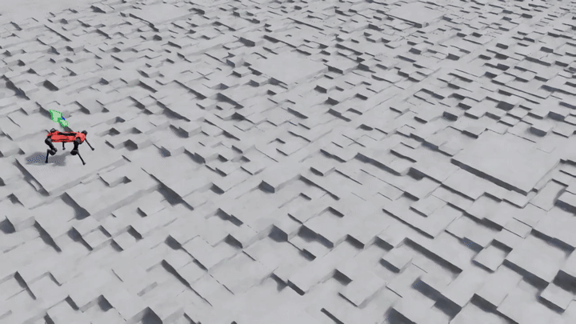

[English](README.md) | [中文](README.zh-CN.md)

# isaaclab-drl-mpc-dynamic

Comparing and combining **Deep Reinforcement Learning (DRL)** and **classical control (MPC / WBC)**
for quadruped locomotion on rough terrain, built on [Isaac Lab](https://github.com/isaac-sim/IsaacLab).

> **Status**: Stage 1 (pure RL) ✅ delivered — PPO baseline trained and documented.
> Stage 2 (classical control) is next. Long-term research project, delivered in stages.

## Motivation

Most locomotion projects pick a side: either learning-based (PPO/SAC end-to-end) or model-based (MPC
+ WBC). Each has known strengths and weaknesses:

- **DRL** handles complex terrain and contact-rich dynamics, but is sample-inefficient and hard to
  interpret.
- **MPC / WBC** provides physical guarantees and is data-efficient, but struggles with unmodeled
  dynamics.

This project builds **both pipelines on the same robot (Anymal-D) and same terrain**, then explores
**principled ways to combine them** — using one to compensate for the other's weakness.

## Stages

| Stage | Scope | Status |
|---|---|---|
| **[stage_1_pure_rl](stage_1_pure_rl/README.md)** | Anymal-D locomotion on rough terrain, PPO (`rsl_rl`) | ✅ **Delivered** — [results & demo](stage_1_pure_rl/README.md) |
| **stage_2_classical** | MPC + Whole-Body Controller using Pinocchio, no learning | 📋 Planned (next) |
| **stage_3_hybrid** | Hybrid approaches (e.g. MPC as RL warm start, RL learns residual dynamics for MPC) | 📋 Planned |
| **shared/** | Dynamics wrappers, evaluation tools, visualization utilities | 📋 Planned |

See [`docs/roadmap.md`](docs/roadmap.md) for the full plan.

## Stage 1 results at a glance

Trained on 4096 parallel envs for 1500 iterations (≈147M steps, 58 min on a single RTX 5070 Ti):
mean episode reward **17.56**, **92.5%** of episodes end by time-out rather than falling,
velocity-tracking reward at **0.83** of its ≈1.0 ceiling, terrain curriculum settled at level
**5.9 / 9**. Full metrics, training curves and reproduction commands:
[stage_1_pure_rl/README.md](stage_1_pure_rl/README.md).

## Stack

- **Simulator**: Isaac Lab (Isaac Sim 4.x)
- **Robot**: Anymal-D
- **DRL**: PPO via `rsl_rl` (stage 1, delivered); SAC and a from-scratch PyTorch PPO as optional follow-ups
- **Classical control**: Pinocchio for rigid-body dynamics, QP-based MPC + WBC
- **Hardware**: Ubuntu 22.04, RTX-class GPU (stage 1 trained on an RTX 5070 Ti, 16 GB)

## License

TBD (will be set when repository becomes public).

## Acknowledgements

Parts of the documentation and tooling in this project were developed with AI assistance.
