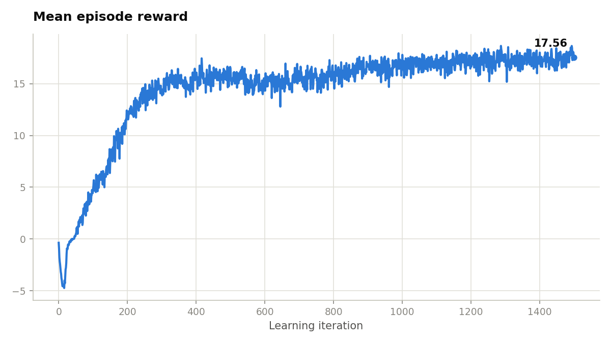
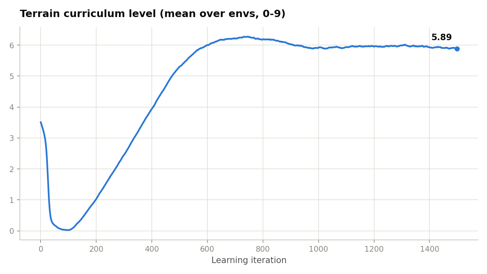

# Stage 1 — Pure RL: Anymal-D locomotion on rough terrain

PPO baseline for the [isaaclab-drl-mpc-dynamic](../README.md) project: an ANYbotics Anymal-D
quadruped learns to walk over procedurally generated rough terrain in Isaac Lab, trained with
[`rsl_rl`](https://github.com/leggedrobotics/rsl_rl). This policy is the learning-based reference
that stage 2 (MPC + WBC) and stage 3 (hybrid) will be compared against.


*One of 32 parallel evaluation environments (the fixed viewport camera covers a single robot).
Green arrow = commanded base velocity, blue arrow = measured base velocity — their overlap is the
velocity-tracking quality made visible.*

## Results

Final numbers after 1500 iterations × 4096 parallel envs (≈147M env steps, 57.6 min on a single
RTX 5070 Ti 16 GB, ~43k steps/s):

| Metric | Value | Reading |
|---|---|---|
| Mean episode reward | **17.56** | up from −4.6 early in training |
| Mean episode length | **930 / 1000 steps** | most episodes survive the full 20 s |
| Time-out terminations | **92.5%** | only 7.5% end early by base contact (fall) |
| Velocity-tracking reward (`track_lin_vel_xy_exp`) | **0.83** (ceiling ≈ 1.0) | main task term near saturation |
| Linear velocity error (xy) | **0.31 m/s** | tracking residual on rough terrain |
| Terrain curriculum level | **5.89 / 9** (peak ≈ 6.3) | promotion/demotion equilibrium around level 6 |
| Mean action std | 0.86 → **0.41** | exploration noise collapses as the policy commits |

<p>
  
  
</p>

The terrain curve has the expected curriculum shape: envs start spread over levels 0–9
(mean ≈ 3.5), collapse toward easy terrain while the policy is still random, then climb as walking
emerges and settle into a promotion/demotion equilibrium around level 6 — a capability plateau,
not a regression.

Regenerate both figures from the TensorBoard logs:

```bash
python scripts/plot_training_curves.py            # picks the latest run automatically
python scripts/plot_training_curves.py --run logs/rsl_rl/stage_1_pure_rl/2026-08-03_00-44-21
```

## Setup

| Component | Value |
|---|---|
| Robot | Anymal-D (`ANYMAL_D_CFG`) |
| Terrain | Isaac Lab rough-terrain generator, 10-level curriculum (0–9) |
| Observations | 235-dim (proprioception + velocity command + 187-dim height scan) |
| Actions | 12 joint-position targets at 50 Hz |
| Episode | 20 s (1000 control steps) |
| Algorithm | PPO (`rsl_rl`) |
| Networks | actor & critic MLPs, 235 → 512 → 256 → 128 → 12 / 1, ELU |
| Task ID | `Stage-1-Pure-Rl-v0` |

## Reproduce

Install [Isaac Lab](https://isaac-sim.github.io/IsaacLab/main/source/setup/installation/index.html)
first, then install this extension into the same Python environment:

```bash
python -m pip install -e source/stage_1_pure_rl
```

Train (57.6 min on an RTX 5070 Ti; reduce `--num_envs` if you run out of VRAM):

```bash
python scripts/rsl_rl/train.py --task Stage-1-Pure-Rl-v0 --num_envs 4096 --max_iterations 1500 --headless --seed 1
```

Watch the curves during or after training:

```bash
tensorboard --logdir logs/rsl_rl/stage_1_pure_rl --port 6006 --bind_all
```

Roll out the newest checkpoint and record a 12 s video (600 steps × 0.02 s):

```bash
python scripts/rsl_rl/play.py --task Stage-1-Pure-Rl-v0 --num_envs 32 --headless --video --video_length 600
```

Artifacts land in `logs/rsl_rl/stage_1_pure_rl/<timestamp>/`: checkpoints (`model_*.pt`), the exact
configs (`params/`), a `git/` snapshot of the working tree at launch, TensorBoard events, and videos
under `videos/play/`. The raw demo video behind the GIF above is committed at
[`docs/stage1_demo.mp4`](docs/stage1_demo.mp4).

## Deferred (optional follow-ups)

- PPO re-implemented from scratch in PyTorch (originally roadmap W2)
- SAC comparison on the same task

Both are deliberately deferred: the `rsl_rl` PPO baseline above is the stage-1 deliverable that
stages 2 and 3 compare against.
